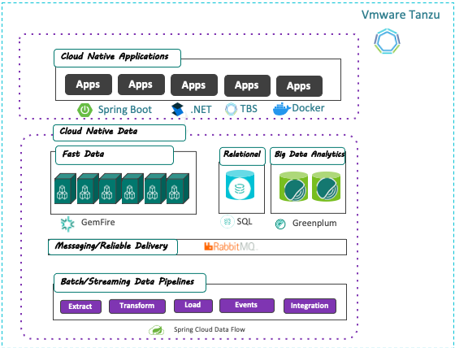

### What is Tanzu Data?

**Tanzu Data** is a _multi-cloud_, _multi-platform_ portfolio of messaging, integration, database, warehouse and management solutions for building modern applications.

In this session, we will demonstrate some of the major features of the **Tanzu Data Services** portfolio by building and deploying a **Petclinic Dashboard**. This will be the realtime analytics portal for our **Petclinic** app. 

#### Our Agenda
1. We will use **Spring Cloud Data Flow** to deploy a realtime data pipeline which will feed our Dashboard's **Alerts** system. This is the module that will notify us when new data is available. The data pipeline will use **Petclinic** app's **Tanzu MySQL** backend as its source and **log** as its sink, and it will use **Tanzu RabbitMQ** as the message broker. Simultaneously, using its **multi-IO streaming** feature, it will also send data to a second sink using its **Change Data Capture** connector.
2. We will ingest **social data** into a **Tanzu Greenplum** cluster and use it to generate an adhoc geographical visualization of pet trends using Greenplum's **PostGIS** and **GPText** libraries. We will use Greenplum's **PXF Federated Queries** to include the Petclinic's MySQL backend in our adhoc query. Also, we will use our **Wavefront** integration to detect the **elastic scalability** of our Greenplum cluster in its scaling up and down to accomodate the changing volume of data.   
3. Simultaneously, we will deploy an ML model that will use clustering algorithms to recommend **High Viability** areas for petclinic expansion. We will handle training and inference of our model using Greenplum's **Apache MADlib**, and accelerate model consumption using **Tanzu Gemfire**.
4. We will demonstrate the resiliency and availability of our data architecture by showing the continuous availability of the data nodes and the Dashboard, despite randomly killing various nodes throughout the architecture.

Let's get started!
